# 项目框架

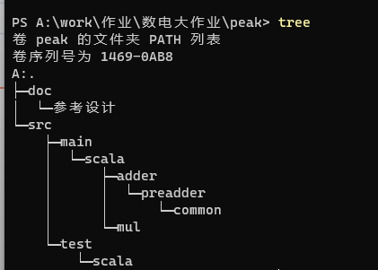
# 配置环境:
## 编译环境:
java jdk21
scala 2.13.12
chisel 6.0.0-RC
gcc 
powershell
millw or sbt
verilator(未使用)
firtool 1.61
## 开发环境
git 
markdown 
vscode or idea
gtkwave

# 工具介绍
## chisel如何编译成sv?如何生成电路?

fir与vcd

调用api输出sv

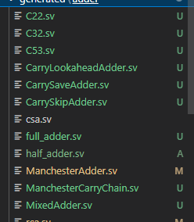

chisel的依赖项

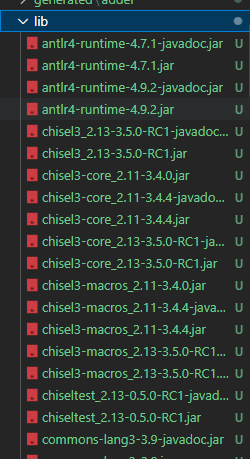

mill构建工具

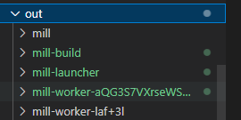

## test

### wave检查波形
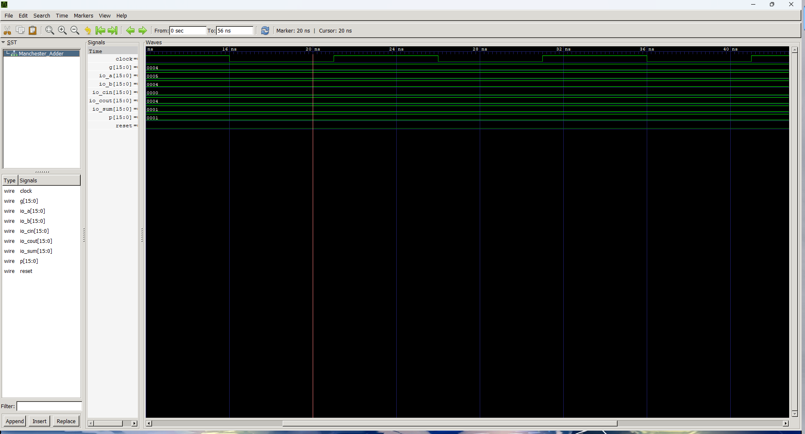

### 编写chiseltest
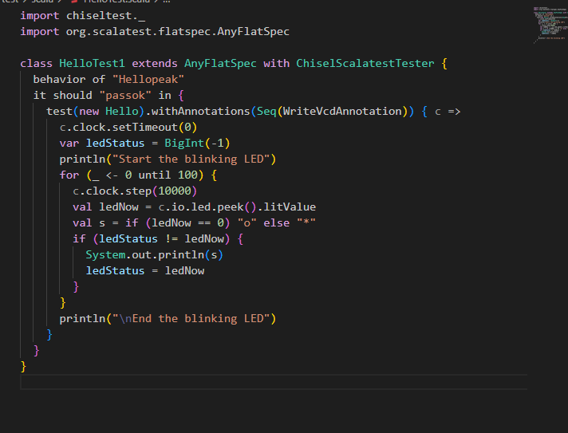

### 网表输出

[在线小网站](http://digitaljs.tilk.eu/#)

或者综合工具vcs,verlator,yosys

### 版图

参考设计    
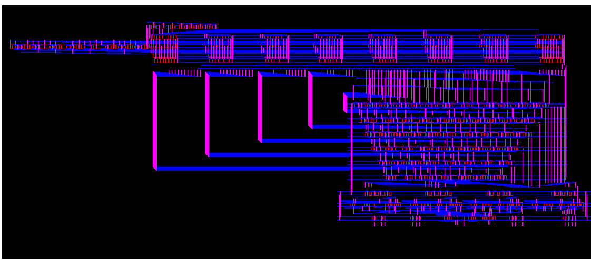

功耗分析
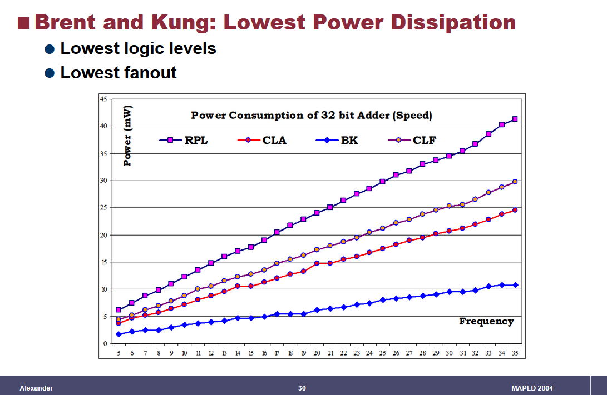
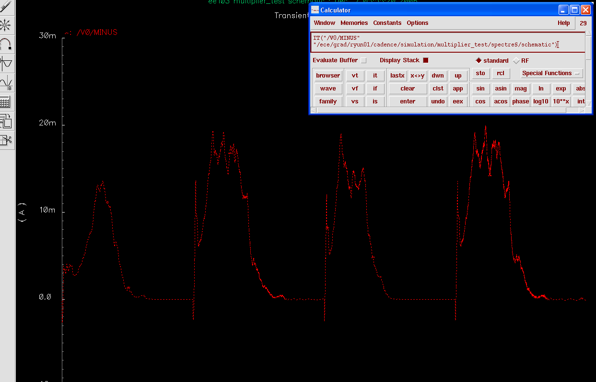

# 原理设计

## 加法设计

### CLA
在位宽过高的情况下如何降低复杂度 

在32位宽的条件下 c32有32项,最大的项展开有32个积

如何优化?

两个思路:
1.高基加法
2.多级前瞻

例如: 使用 16 个 4 位加法器和 5 个先行进位生成器构建 64 位先行进位加法器。

可以使用 6 位或 8 位先行块来减少给定字宽的先行级别数。但考虑到扇入较高的门会带来更长的延迟，这可能不值得。

对于不满足位宽整:
该 64 位加法器不会产生许多应用中需要的进位信号 (c64)。在超前进位加法器中，有两种方法可以解决这个问题。一种是根据辅助信号或位置 k − 1 的操作数和和位在外部生成 cout：

Tlookahead−add = 4 log4 k + 1 gate levels

或者直接添加一位 比如60位设计成61位

### Lings adder

Ling 加法器是一种超前进位加法器，可显着节省硬件成本。考虑进位递归及其通过四个步骤展开：

优化进位链的设计 

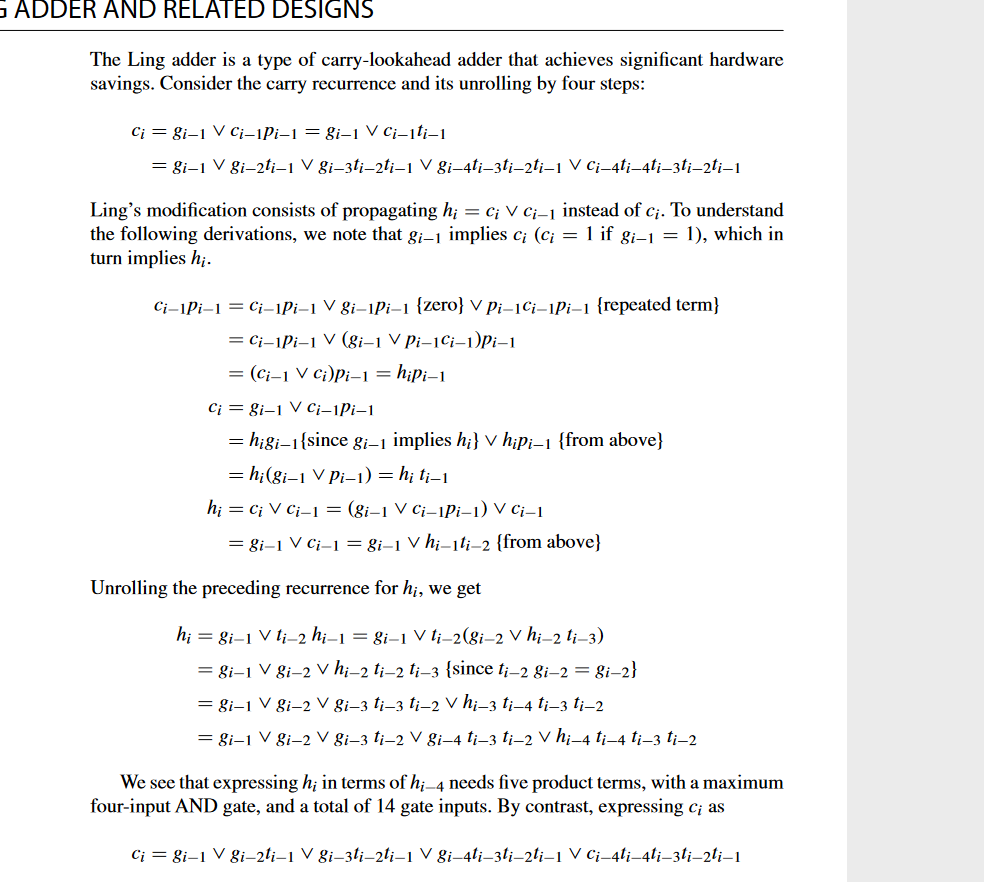

我们看到，用 hi−4 表达 hi 需要 5 个乘积项，最多有 4 个输入与门，总共 14 个门输入。相比之下，将 ci 表示为

ci = gi−1 ∨ gi−2ti−1 ∨ gi−3ti−2ti−1 ∨ gi−4ti−3ti−2ti−1 ∨ ci−4ti−4ti−3ti−2ti−1

需要 5 项，最多有 5 个输入与门，总共 19 个门输入。如果我们可以使用线或（具有 9 个输入的 3 个门与具有 14 个输入的 4 个门），则 hi 相对于 ci 的优势会更大。然而，一旦 hi 已知，与 si = pi ⊕ ci 相比，可以通过稍微复杂的表达式获得总和：

## Variations in Fast Adders
超前进位方法代表了现代计算机中高速加法器最广泛使用的设计。然而，某些替代设计要么与超前进位加法器具有相当的竞争力，要么在特定的硬件实现或技术限制下提供优势。本章讨论了这些替代设计中最重要的以及各种混合组合。

### carry skip adder (假设跳跃延迟和纹波延迟相等)

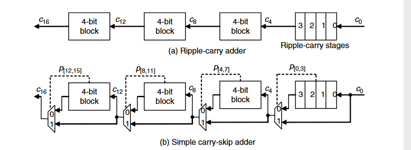

延迟计算式 
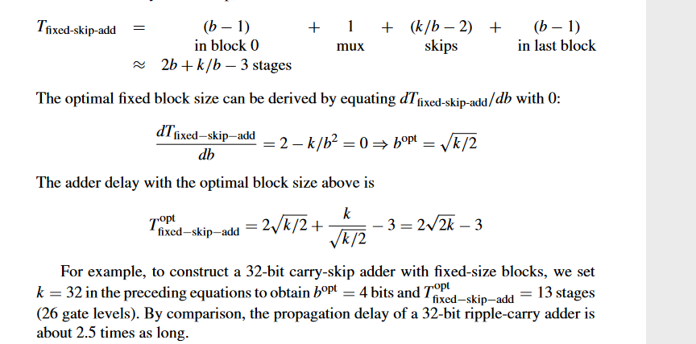

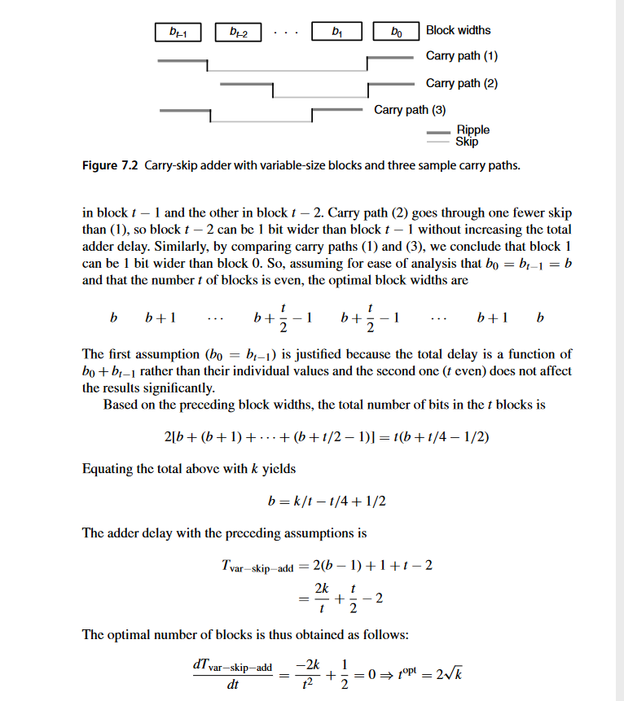

假设跳跃延迟和纹波延迟相等，并且假设纹波延迟与块宽度成线性比例。这些在实践中可能并不正确。例如，在互补金属氧化物半导体实现中，曼彻斯特进位链中的纹波延迟随着块宽度的平方而增长。

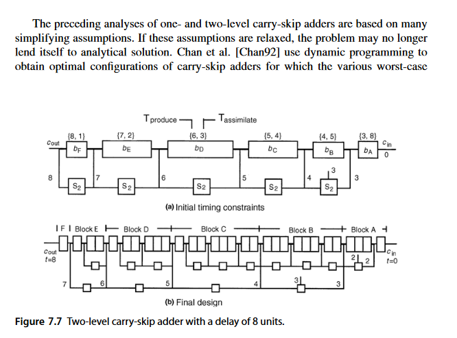

### 树形加法树 
参考书籍

## 乘法

### 无乘法指令
转化为加法移位指令

### 流水加法
移位寄存器,多级复用

### 高基数
booth编码等

### 多操作数
树性结构与并行结构

### 综合优化
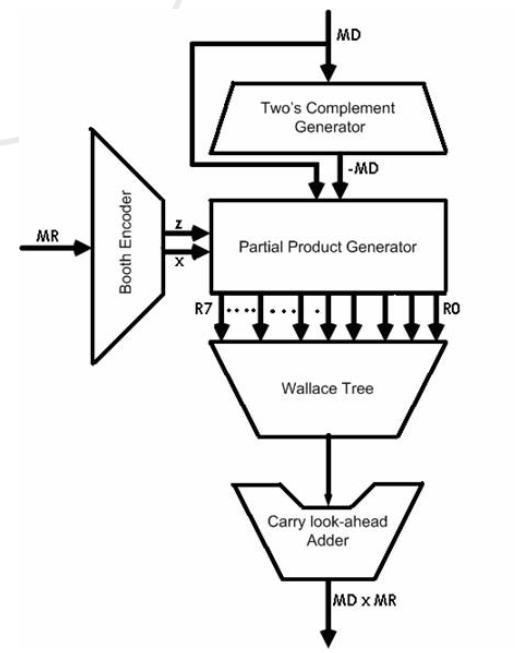

## 参考文献doi

### BKA
10.1142/S0218126623502122 

[功耗](https://www.powershow.com/view4/55d38a-ZGUzM/)

[VHDL_Design_Tips_and_Low_Power_Design_Techniques_powerpoint_ppt_presentation](https://jeit.ac.cn/en/article/doi/10.11999/JEIT230815)

[其他设计](https://web.archive.org/web/20100615082939/http://www.eecs.tufts.edu/~ryun01/vlsi/index.htm)
